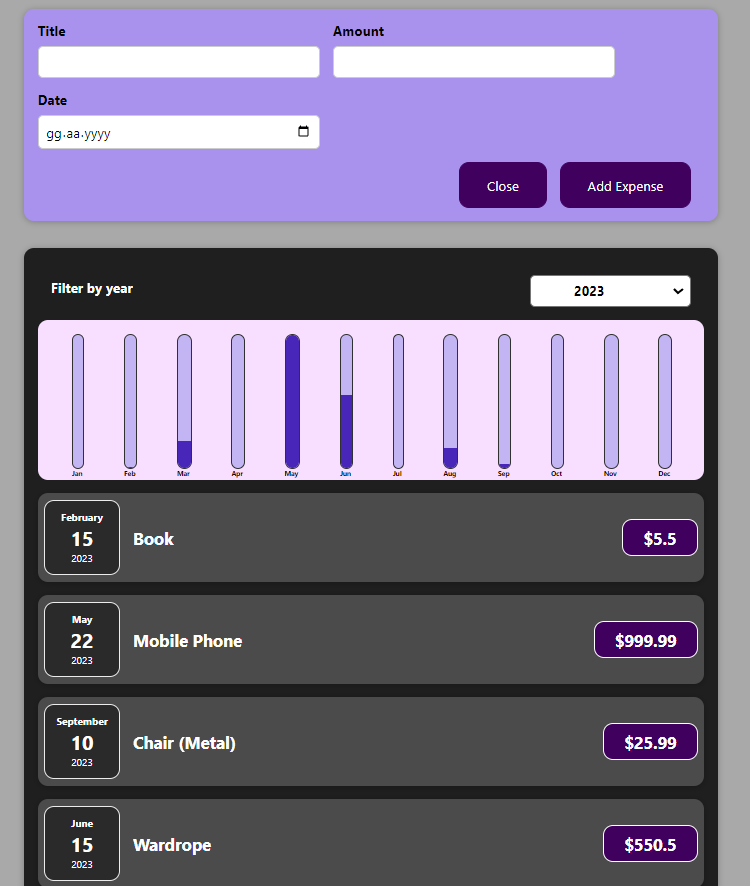

# Expense List App

This project contains an Expense List application developed in the first section of my React course. This application is designed to help users track their daily expenses.    
Direct link to project: https://sygrok.github.io/Expenses-Tracking-App-With-React/

## Features

- You can add new expenses, each with a name and amount.
- You can use the chart section to see monthly expenses.
- You can calculate the total expense amount.

## Technologies Used

- React: Used to create the user interface and provide an interactive experience through its component-based architecture.
- CSS: Used for basic styling and layout.

## How to Run

1. Clone this project or download it as a ZIP file.
2. Navigate to the project directory and open the terminal.
3. Use the command `npm install` to install the dependencies.
4. Use the command `npm start` to start the application.
5. Go to `http://localhost:3000` in your browser.

---

This project has been developed for educational purposes and is open to future enhancements. It includes features for adding products and listing products by year.
